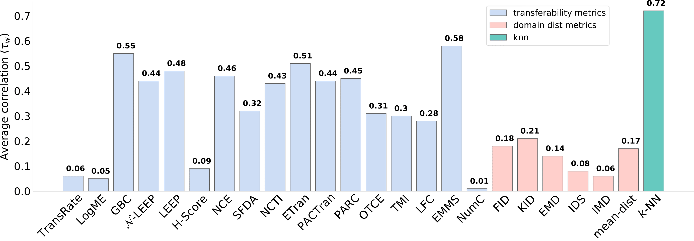

## k-NN as a Simple and Effective Estimator of Transferability

__Abstract.__ How well can one expect transfer learning to work
in a new setting where the domain is shifted, the
task is different, and the architecture changes?
Many transfer learning metrics have been pro-
posed to answer this question. But how accurate
are their predictions in a realistic new setting? We
conducted an extensive evaluation involving over
42,000 experiments comparing 23 transferability metrics 
across 16 different datasets to assess
their ability to predict transfer performance. Our
findings reveal that none of the existing metrics
perform well across the board. However, we find
that a simple k-nearest neighbor evaluation – as is
commonly used to evaluate feature quality for self-
supervision – not only surpasses existing metrics,
but also offers better computational efficiency and
ease of implementation.

  

